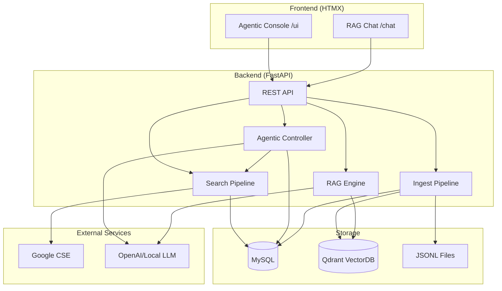
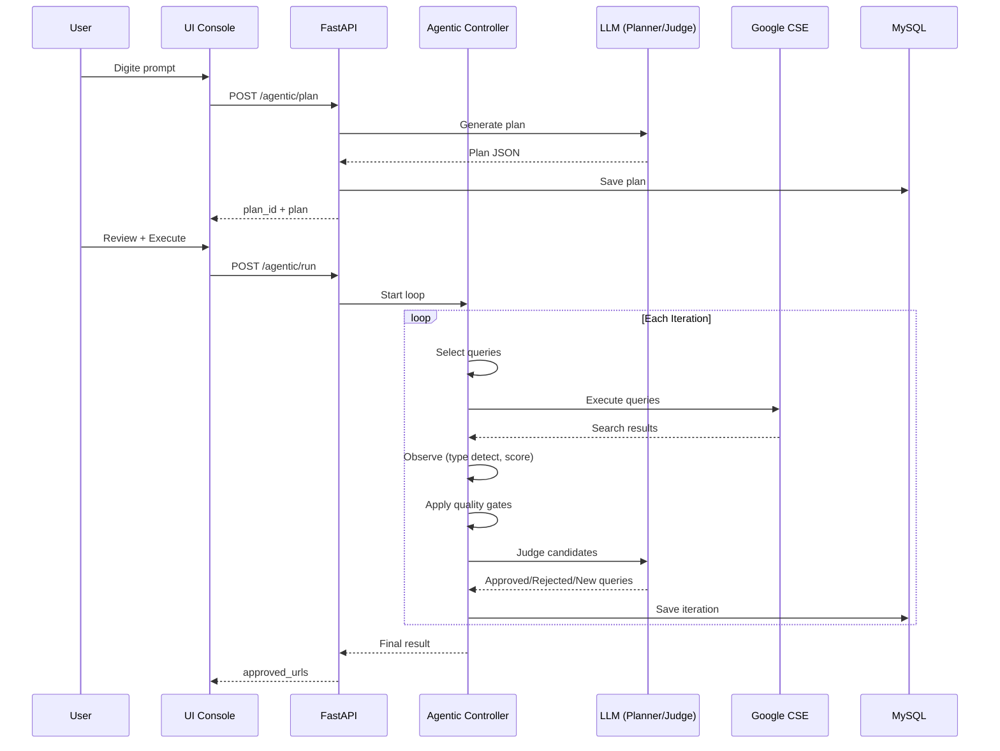
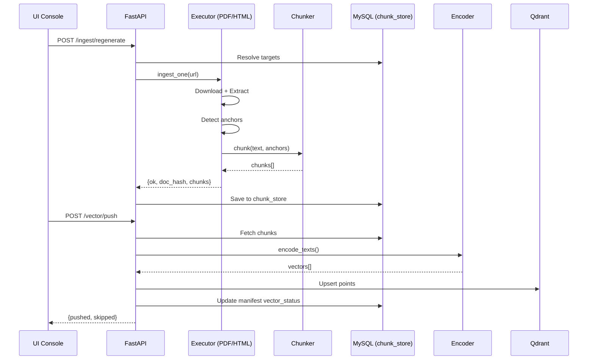
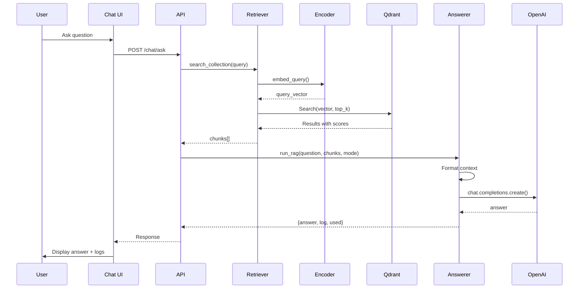

<!-- SPDX-License-Identifier: MIT | (c) 2025 Leopoldo Carvalho Correia de Lima -->

# System Architecture

Arquitetura técnica completa do Agentic Reg Ingest.

## 🏗️ Visão Geral



---

## 📦 Componentes

### Layer 1: Frontend (HTMX)

**apps/ui/static/index.html** - Agentic Console
- Plan generation UI
- Execution monitoring
- Audit trail viewer
- Approved docs manager
- Chunk operations (regenerate, push, delete)

**apps/ui/static/chat.html** - RAG Chat
- Query input
- Mode selector (grounded/inference)
- Answer display
- Retrieval logs

**Características:**
- Zero build (HTML estático)
- HTMX para interatividade
- JavaScript mínimo (fetch API)
- Real-time polling (3-5s)

### Layer 2: Backend (FastAPI)

**apps/api/main.py** - Main API
- Health check
- Pipeline endpoints (/run/search, /run/ingest)
- Agentic endpoints (/agentic/plan, /run, /iters)
- Vector endpoints (/vector/push, /delete)
- Chunk operations (/ingest/regenerate, /chunks/status)
- UI serving (/ui, /chat)

**apps/api/routes_chat.py** - Chat Router
- POST /chat/ask (RAG query)
- Validation (Pydantic)
- Error handling

**Middleware:**
- Structured logging (structlog)
- Request ID tracking
- CORS (se necessário)

### Layer 3: Pipelines

**pipelines/search_pipeline.py** - Search
- Google CSE integration
- Multi-factor scoring (authority, freshness, specificity, type, anchorability)
- Type detection (magic bytes, headers, URL ext)
- MySQL caching com TTL
- Diff detection (NEW/CHANGED/SAME)

**pipelines/ingest_pipeline.py** - Ingest
- Orchestrates executors
- Routes por tipo (PDF/HTML/ZIP)
- Diff checking
- Error handling com retry
- JSONL emission

**pipelines/agentic_controller.py** - Agentic Loop
- Plan execution
- Query selection (max_queries_per_iter)
- CSE calls
- Candidate observation
- Quality gates application
- LLM judge
- Re-planning
- Stop conditions
- Persistence (agentic_plan/iter)

**pipelines/executors/** - Type-specific Ingestors
- `pdf_ingestor.py`: pdfplumber → LLM markers → anchor chunk
- `html_ingestor.py`: readability → anchor detect → chunk
- `zip_ingestor.py`: nested file extraction

### Layer 4: Core Services

**agentic/llm.py** - LLM Client
- plan_from_prompt()
- judge_candidates()
- suggest_pdf_markers()
- extract_html_structure()
- Retry logic
- Temperature configs

**agentic/cse_client.py** - Google CSE
- search() com query e filters
- Respect allowlist/deny patterns
- Caching via MySQL

**agentic/scoring.py** - Multi-factor Scorer
- Authority (domain-based)
- Freshness (last_modified)
- Specificity (query match)
- Type preference (pdf > zip > html)
- Anchorability (Art., Anexo regex count)
- Language (pt-BR boost)

**agentic/quality.py** - Quality Gates
- apply_quality_gates()
- Hard rules (type, age, score, anchors)
- count_anchor_signals()

**agentic/detect.py** - Type Detection
- Magic bytes sniff (Range GET 0-7)
- Content-Disposition filename
- Content-Type parsing
- URL extension
- Fallback: unknown → LLM routing

**agentic/normalize.py** - URL Normalization
- Scheme/netloc lowercase
- Fragment removal
- Query param ordering
- Duplicate detection

### Layer 5: Ingestion

**ingestion/chunkers.py** - TokenAwareChunker
- chunk() - Standard token split
- chunk_with_anchors() - Anchor-aware
- Tiktoken encoding
- Max tokens: 512, overlap: 50

**ingestion/anchors.py** - AnchorDetector
- segment_by_anchors()
- Regex patterns (Art., Cap., Anexo, Tabela, H1-H3)
- Line-based segmentation

**ingestion/emitters.py** - JSONLEmitter
- emit_chunks() para JSONL
- One record per line
- Metadata inclusion

### Layer 6: Vector

**vector/qdrant_loader.py** - Qdrant Operations
- push_doc_hashes()
- delete_by_doc_hashes()
- exists_by_doc_hash()
- Batch processing

**vector/qdrant_client.py** - Client Helpers
- get_client()
- ensure_collection()
- Point operations

**embeddings/encoder.py** - Embeddings
- encode_texts() - OpenAI ou local
- Provider-agnostic
- Batch support
- Fallback dummy (testes)

### Layer 7: RAG

**rag/retriever_qdrant.py** - Retriever
- search_collection()
- embed_query()
- Score filtering
- Payload enrichment

**rag/answerer.py** - Answer Generation
- grounded_answer() - Temperature 0
- inference_answer() - Temperature 0.2
- run_rag() - Orchestrator
- Context formatting

### Layer 8: Database

**db/models.py** - SQLAlchemy ORM
- SearchQuery, SearchResult
- DocumentCatalog
- ChunkManifest, ChunkStore
- AgenticPlan, AgenticIter

**db/dao.py** - Data Access Objects
- CRUD operations
- Upsert helpers
- Standalone functions (get_chunks_by_hashes, mark_manifest_vector)

**db/session.py** - Session Management
- DatabaseSession generator
- Connection pooling

---

## 🔄 Fluxos de Dados

### Fluxo 1: Agentic Search



### Fluxo 2: Ingest → Vector



### Fluxo 3: RAG Chat



---

## 🔐 Security Architecture

### Authentication & Authorization

**Current:** None (internal use)

**Recommended for production:**
- OAuth2/JWT para API
- Role-based access (admin, operator, viewer)
- API keys por serviço

### Secrets Management

- `.env` file (gitignored)
- Environment variables
- **Never hardcode**: OPENAI_API_KEY, MYSQL_PASSWORD, etc.

### Data Flow Security

```
Internet (CSE) → TLS → API
API → DB (localhost ou TLS)
API → Qdrant (localhost ou TLS+API_KEY)
API → OpenAI (TLS, API_KEY header)
```

---

## 📊 Scalability

### Horizontal Scaling

**Stateless components:**
- FastAPI (multiple uvicorn workers)
- Executors (parallel processing)
- Embeddings (batch)

**Stateful components:**
- MySQL (read replicas)
- Qdrant (sharding se > 10M pontos)

### Performance Targets

| Operation | Target | Actual |
|-----------|--------|--------|
| Search query | <2s | ~1.5s |
| Ingest (1 PDF) | <30s | ~20s |
| Vector push (100 chunks) | <10s | ~5s |
| RAG query | <3s | ~2s |

---

## 🔧 Configuration Management

### Layers

1. **Hardcoded Defaults** (código)
2. **YAML Configs** (configs/*.yaml)
3. **Environment Variables** (.env)
4. **Runtime Overrides** (API params)

**Precedência:**
```
Runtime > .env > YAML > Hardcoded
```

### Config Files

```
configs/
├── agentic.yaml      # Quality gates, stop conditions
├── cse.yaml          # Google CSE settings
├── db.yaml           # MySQL connection
├── ingest.yaml       # Pipeline settings, chunker
└── vector/settings.yaml  # Qdrant config
```

---

[← Back to Overview](../overview/PRODUCT_OVERVIEW.md) | [Next: Data Model →](DATA_MODEL.md)

