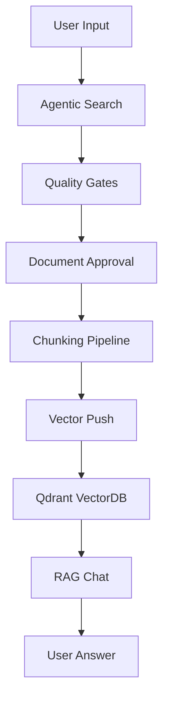

<!-- SPDX-License-Identifier: MIT | (c) 2025 Leopoldo Carvalho Correia de Lima -->

# Agentic Reg Ingest

## Pipeline de IA para Busca e Ingestão de Documentos Regulatórios

[](https://opensource.org/licenses/MIT)
[](https://www.python.org/downloads/)
[](https://fastapi.tiangolo.com/)
[](https://qdrant.tech/)

---

## 🎯 Elevator Pitch

**Agentic Reg Ingest** é um sistema de IA **production-ready** para **buscar, processar e indexar documentos regulatórios** (ANS, TISS, Planalto) com:

- 🤖 **Agentic Search** - Loop autônomo Plan→Act→Observe→Judge→Re-plan
- 📦 **Chunking Inteligente** - Segmentação por anchors (Art., Anexo, Tabela) + token-aware
- 🗄️ **Vector Database** - Qdrant com embeddings OpenAI/local
- 💬 **RAG Chat** - Perguntas sobre documentos com citações
- 📊 **Full Audit Trail** - Compliance e rastreabilidade completa

**Casos de uso:**
- Auditoria regulatória com citações automáticas
- Chat de perguntas sobre normas (grounded ou com inferência)
- Monitoramento de atualizações normativas
- Knowledge base para compliance e jurídico

---

## ⚡ Quick Links

| Categoria | Link | Descrição |
|-----------|------|-----------|
| 🚀 **Start** | [Setup Guide](setup/START_HERE.md) | Comece aqui - instalação |
| 📖 **Guides** | [User Guides](guides/) | Guias de uso |
| 🏗️ **Architecture** | [Architecture](architecture/ARCHITECTURE.md) | Arquitetura do sistema |
| 🔧 **Operations** | [Operations](operations/) | Deploy, runbooks, segurança |
| 💬 **RAG Chat** | [Chat Guide](guides/CHAT_RAG_GUIDE.md) | Como usar o chat |
| 📡 **API** | [API Reference](api/API_REFERENCE.md) | Documentação da API |

---

## 🌐 Interfaces Web

### Agentic Console
```
http://localhost:8000/ui
```
**Funcionalidades:**
- Gerar planos de busca via LLM
- Executar loop agentivo
- Visualizar audit trail
- Gerenciar documentos aprovados
- Regenerar chunks
- Push para VectorDB

### RAG Chat
```
http://localhost:8000/chat
```
**Funcionalidades:**
- Perguntas em linguagem natural
- Modo Grounded (só trechos)
- Modo Inferência (raciocínio)
- Logs de retrieval
- Citações automáticas

---

## 🏗️ Arquitetura



**Componentes Principais:**
- **Search Pipeline**: Google CSE + scoring multi-fator
- **Agentic Loop**: LLM planner + judge + iterative refinement
- **Ingest Pipeline**: Type detection + routing + chunking
- **Vector Infrastructure**: Embeddings + Qdrant + retrieval
- **RAG Engine**: Query→Retrieve→Answer com citações

[→ Ver arquitetura completa](architecture/ARCHITECTURE.md)

---

## 📊 Features

### ✅ Agentic Search
- Plan generation via LLM
- Multi-iteration refinement
- Quality gates (type, age, score, anchors)
- Judge LLM para avaliar candidatos
- Audit trail completo

### ✅ Document Processing
- Robust type detection (magic bytes, headers, LLM)
- PDF: page extraction + LLM markers + anchor chunking
- HTML: readability + structure detection + anchor chunking
- ZIP: nested file processing

### ✅ Vector Database
- Qdrant integration
- OpenAI embeddings (ou local LM Studio/Ollama)
- Idempotent push (deterministic IDs)
- Batch processing
- Overwrite mode

### ✅ RAG Chat
- Grounded mode (factual, citações exatas)
- Inference mode (raciocínio permitido)
- Retrieval logs
- Humanized responses (pt-BR)

### ✅ Web UI (HTMX)
- Zero build - HTML estático
- Real-time updates
- Batch operations
- Status monitoring

---

## 🎓 Casos de Uso

[→ Ver casos de uso detalhados](overview/USE_CASES.md)

### 1. Auditoria Regulatória
"Quais normas da ANS sobre prazos de atendimento foram atualizadas nos últimos 2 anos?"

### 2. Compliance Check
"Minha operadora está cumprindo os requisitos da RN 465 sobre TISS?"

### 3. Análise de Impacto
"Como a nova versão do TISS afeta nossos sistemas?"

### 4. Knowledge Base
Chat RAG para perguntas ad-hoc com citações automáticas.

---

## 🚀 Getting Started

### Prerequisites
- Python 3.12 (⚠️ 3.13 tem incompatibilidade com SQLAlchemy)
- MySQL 8.0+
- Docker (para Qdrant)
- OpenAI API key (ou LLM local)
- Google CSE credentials

### Quick Install
```bash
# 1. Clone
git clone <repo>
cd agentic-reg-ingest

# 2. Setup
python3.12 -m venv .venv
source .venv/bin/activate
pip install -r requirements.txt

# 3. Configure
cp .env.example .env
# Edit: MYSQL_*, OPENAI_*, CSE_*

# 4. Migrate
make db-init
make migrate
make migrate-agentic
make migrate-chunks

# 5. Start Qdrant
docker run -d -p 6333:6333 qdrant/qdrant

# 6. Start API
make api

# 7. Access
# http://localhost:8000/ui    - Agentic Console
# http://localhost:8000/chat  - RAG Chat
```

[→ Ver guia completo de setup](setup/START_HERE.md)

---

## 📖 Documentation Structure

```
docs/
├── overview/        → Visão geral, casos de uso
├── architecture/    → Arquitetura técnica
├── guides/          → Guias de uso
├── setup/           → Instalação
├── operations/      → Deploy, runbooks, segurança
├── api/             → Referência de API
├── rag/             → RAG evaluation
├── compliance/      → Auditoria, proveniência
├── project/         → Contribuição, governança
├── development/     → Debug, testes
├── changelog/       → Histórico
└── roadmap/         → Próximos passos
```

---

## 🎯 Next Steps

1. 📖 [Read Product Overview](overview/PRODUCT_OVERVIEW.md)
2. ⚡ [Follow Setup Guide](setup/START_HERE.md)
3. 🤖 [Try Agentic Search](guides/AGENTIC_QUICKSTART.md)
4. 💬 [Ask in RAG Chat](guides/CHAT_RAG_GUIDE.md)

---

## 🤝 Contributing

Contributions are welcome! See [CONTRIBUTING.md](project/CONTRIBUTING.md) for guidelines.

## 📄 License

MIT License - see [LICENSE](../LICENSE)

Copyright (c) 2025 Leopoldo Carvalho Correia de Lima

---

**Built with ❤️ for regulatory compliance and knowledge management**

